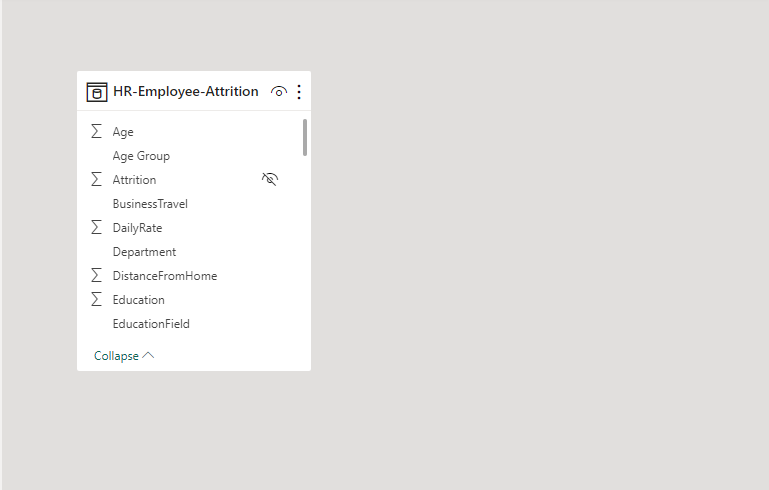
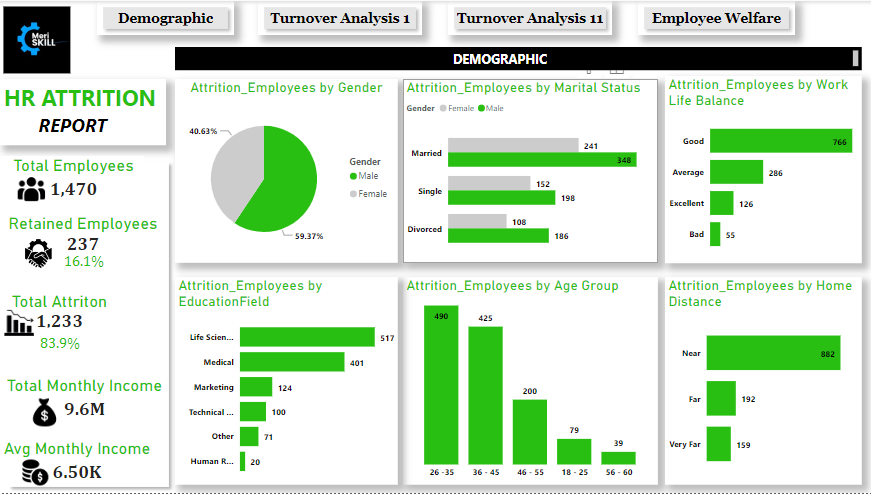
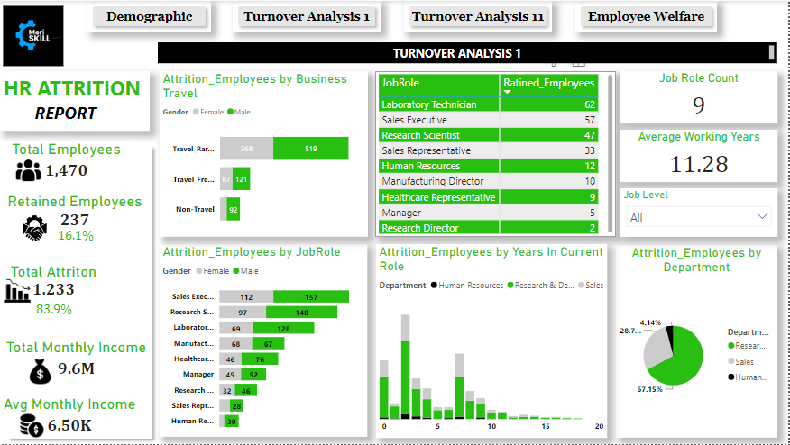
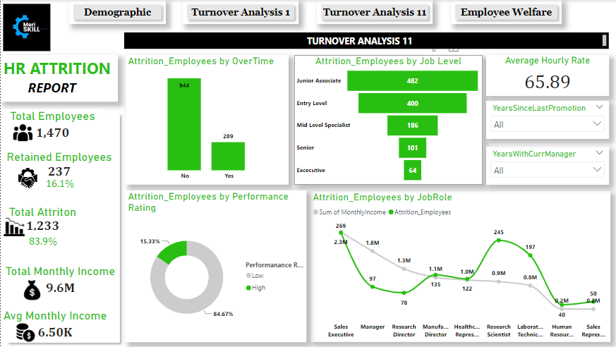
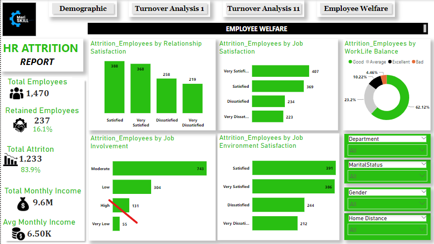

# HR-Analysis-Report

 

## Introduction
This is HR Analysis of **Meriskill Company**.
This report consists of four categories
1. Demographic:
   This report summarizes employee statistics, inculding age groups, gender, distance from home and marital statues, providing insights into workforce diversity and communting patterns for informed decision making.
2. Turnover Analysis 1:
   This report provides insihgts into employee attrition, including departures by department, job roles affected, business travel impact and total years in the current role, aiding in workforce management and retention strategies.
3. Turnover Analysis 11:
   This anlaysis consolidates employee data, featuring attrition by job level, overtime, performance ratings, and attrition across levels, offering insights for effective HR strategies and decision making.
4. Employee Welfare:
   This analysis consolidates employee data on attrition by relationship satisfaction, job satisfaction, work life balance, job involvement and job environment satisfaction.

## Problem Statement
1. Which product generate the highest revenue?
2. which country generate the hightest revenue?
3. what is the best performing day?
4. What product have the highest order?

## Skills/ Concepts Demostrated
The following power BI features was incorporated:
- Data Cleaning
- Data Transformation
- Dax 
- Page Navigation
- Button
- Filters
- Shapes
- Icons

## Modelling
The model is a star schema and it contain only one dimensional table.

## Visualization
The report comprises of four pages and you can interact with the report [here](https://app.powerbi.com/view?r=eyJrIjoiMTIxNDliZWYtZWZhMS00MTJiLWJjZTItNGZkZGY4N2U2OGNkIiwidCI6ImNmYTI1N2FmLTk1N2EtNDU3Ny05MWIyLTU4ZjYwMDgzZmYyZSJ9)

1. Demographic
   
3. Turnover Analysis 1

4. Turnover Analysis 11

5. Employee Welfare

